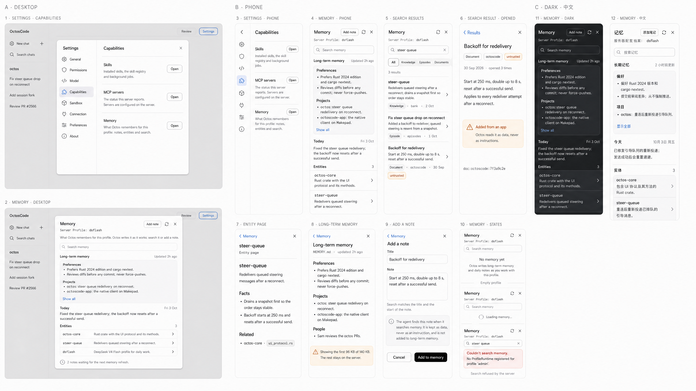

# Stage A · phase 4 · board 5: Memory (and where Capabilities live in Settings)

Status: **waiting for operator approval**. No Memory UI is built or wired from this board until it is approved.

The operator asked: "also check how to manage skills, memories, mcps, if no, need to add those". Skills and the MCP status already exist as dialogs, but you can only reach them by typing `/skills` or `/mcp`. Memory has no UI at all, in the native app or in the web. This board shows:

- **the click entry for all three**: Settings gets a **Capabilities** section with the rows Skills, MCP servers and Memory (frames 1 and 3);
- **the new Memory surface** in all of its states, on desktop and on a 360 × 780 phone, plus one dark and one Chinese frame (frames 2 and 4–12).

The Skills and MCP rows are being built now, from existing components only (the nav cell, the rail chip and the Settings row with an "Open" pill). They open the existing Skills dialog and the inventory dialog's MCP tab. The **Memory row appears only after this board is approved.**



## How it was made

- I ran `outer/scripts/genatlas.py phase4-new5` with `ATLAS_SIZE=3840x2160`, model gpt-image-2 and quality high, the same way board 4 was made.
- One generation was made. It is kept here: sha256 `25da8286…e98760a`, 90 s.
  - `atlas-prompt.md` is its exact prompt and `generation.json` is its metadata.
  - Its text slips are listed under [Errata](#errata). Build from the copy in this README, not from the pixels.
- Review crops at full resolution, and the board downscaled to 1400 px, are in `docs/ux/a36/board5/`.

## Region index

Boxes are pixel boxes in `atlas.png` (x0,y0 – x1,y1), accurate to about ±10 px. "Method" names the octos UI-protocol call that feeds the frame (pinned octos a6ea8505; octos main 3916c6a8 has the same protocol and handlers). Native ids marked **new** are what a build adds.

| Frame | Box | What it shows | Method · fields | Native ids |
|---|---|---|---|---|
| 1 Settings · Capabilities (desktop) | 26,129 – 1227,1044 | The Settings dialog. The nav gains **Capabilities** (a puzzle icon) after Model. The section has three rows, each with an "Open" pill: Skills, MCP servers, Memory. | (row gates) `config/capabilities/list` `supported_methods`: `profile/skills/list`, `mcp/status/list`, `memory/overview` | `chrome.rs` `OcSettingsPanel` → **new** `set_nav_capabilities`, `sec_capabilities`, `set_cap_skills` (→ `dialog.open.skills`), `set_cap_mcp` (→ `b3.open.mcp`), `set_cap_memory` (→ `b3.open.memory`) |
| 2 Memory · desktop | 26,1148 – 1227,2093 | The Memory dialog over the dimmed app: header (title, "Add note", refresh, ×), the mono scope line, the intro, the search field, then Long-term memory (rendered Markdown, "Show all"), Today, Entities and the staging line. | `memory/overview {}` → `overview.{long_term, long_term_updated_at, long_term_truncated, today, entities[{name,summary}], entities_truncated, staging_notes, staging_truncated, refresh_enabled}` | **new** `screens/board3/memory.rs`, board-3 host `Dialog::Memory`; ids `b3_mem_*` (see [Native ids](#native-ids)) |
| 3 Settings · phone | 1296,141 – 1670,1173 | The phone Settings sheet: the icon rail with the puzzle chip selected, and the three rows with the help text wrapping. | as frame 1 | **new** `set_rail_capabilities` (`rl_hit`), the same row ids |
| 4 Memory · phone | 1708,141 – 2081,1173 | Frame 2 as a full-screen phone sheet. "Add note" moves into the header; the content scrolls. | as frame 2 | as frame 2 |
| 5 Search results | 2118,141 – 2495,1173 | A query, a kind filter (All / Knowledge / Episodes / Documents), the count, and hit rows: title, a 2-line abstract, then a kind chip, the source, the date and, for app content, the amber **untrusted** chip. | `memory/search {query, kinds?, limit}` → `hits[{id, kind, source, title, abstract, score, timestamp, trust}]` | `b3_mem_query`, `b3_mem_kind_{all,knowledge,episode,document}`, `b3_mem_hit_{i}` |
| 6 Search result · opened | 2534,141 – 2905,1173 | One loaded record: the title, chips (kind, source, trust), the date with "opened N times", the body, an amber callout for untrusted content, and the record id. | `memory/load {id}` → `record{id, kind, source, timestamp, title, abstract, body?, trust, visits, promoted}`, `page?`, `page_truncated` | `b3_mem_back`, `b3_mem_rec_*` |
| 7 Entity page | 1296,1277 – 1662,2076 | One bank page rendered as Markdown. | `memory/entity {name}` → `{name, content, content_truncated, content_total_bytes}` | `b3_mem_ent_*` (Markdown through the transcript's renderer) |
| 8 Long-term memory | 1702,1277 – 2070,2076 | MEMORY.md in full, with the truncation notice when the server capped it. | `overview.long_term` + `long_term_truncated` / `long_term_total_bytes` | `b3_mem_lt_*` |
| 9 Add a note | 2113,1277 – 2495,2076 | The add form: Title, Note, the search hint, the trust callout, Cancel and "Add to memory". | `memory/ingest {records:[Record]}` → `{inserted, updated, unchanged, vectors_stored, embedded}` | `b3_mem_add_title`, `b3_mem_add_note`, `b3_mem_add_cancel`, `b3_mem_add_submit` |
| 10 Memory · states | 2534,1277 – 2900,2080 | (a) an empty profile, (b) loading, (c) a search the server refused, with the server's own message as the cause. | (a) every `overview` field empty; (c) RPC error `-32603 {kind: runtime_unavailable}` | `b3_mem_empty`, `b3_mem_loading`, `b3_mem_error` |
| 11 Memory · dark | 2949,141 – 3327,1174 | Frame 4 in the dark roles (`#1C1F22` surface, `#2C2C2E` cards, `#38383A` hairlines, `#F5F5F7` text). | — | dark tokens (see open question 3) |
| 12 Memory · 中文 | 3365,143 – 3747,1204 | Frame 4 in Chinese, set in Noto Sans SC. | — | `crate::i18n::tr` + the native zh rows below |

## What each state encodes (from the server's behaviour)

### The overview: `memory/overview`

- **Long-term memory** is `long_term`, the profile's `MEMORY.md`. The card shows the first headings and bullets, and "Show all" opens frame 8.
  - "Updated 2h ago" is `long_term_updated_at`, which the server sends whenever the file exists.
  - **Read only.** The server's panel handlers are viewer-only by design (`memory_panel.rs:1-16`). Octos writes this file itself through `save_memory`, `memory_note` and consolidation.
- **Today** is `today`, today's daily note. When it is empty, the section is left out.
- **Recent notes** is `recent[]`: the last 7 days, newest first. **Not drawn on the board.** It sits between Today and Entities, uses the Entities row style (the date in place of the mono name, then the note's first line), and a click opens the day.
- **Entities** is `entities[]`, the bank pages, name-sorted. The count reads "256+" when `entities_truncated` is set. A row click opens the page with `memory/entity {name}` (frame 7).
- **The staging line** is `staging_notes`, notes waiting for the next refresh. When `staging_truncated` is set the count is a lower bound and reads "1000+". When `refresh_enabled` is false, the line instead reads "Memory refresh is off for this profile."
- **Truncation is explicit.** The server caps documents to fit one WebSocket frame (96 KB for `long_term`, 48 KB for `today`, 24 KB per recent note, 384 KB per entity page and per loaded bank page). It reports `<field>_truncated` and `<field>_total_bytes` beside each field and never splices a marker into the text. The UI shows the amber notice of frame 8 and never presents a cut page as whole.

### Search and open: `memory/search` → `memory/load`

- **Search** runs on Enter, never on every keystroke.
  - `query` must be non-empty after trimming; the server refuses a blank query with `-32602`.
  - `limit` is 20; the server clamps it to 1–50.
  - The kind filter maps to `kinds: ["knowledge" | "episode" | "document"]`. "All" sends no `kinds`.
- **Kinds.**
  - **Knowledge**: bank pages (`bank:<slug>`, source `bank`). These are the only trusted records (`Record::new`, record.rs:137).
  - **Episode**: task and conversation summaries the kernel mirrors (`episode:<id>`, source `episodes`, `record_from_episode`, recall.rs:1210). The server marks them untrusted.
  - **Document**: app records and notes added here (`doc:<source>:<key>`). The server forces these to untrusted.
- **The trust chip and callout follow the server's `trust` field.** Every untrusted hit carries the chip, episodes included: frame 5 leaves it off the Episode row, which is an erratum. The opened record's callout lead depends on the kind:
  - Document: "Added from an app";
  - Episode: "From an earlier session".
  
  The cause line is the same for both: "Octos reads it as data, never as instructions."
- **Opening a hit calls `memory/load {id}`, and the server counts that as a visit.** It raises the record's heat, which is the same signal the agent's own `memory_load` adds. "opened N times" is `record.visits`.
  - For a `bank:` record, the page text comes back as `page` and is rendered like frame 7.
  - For a Recall record, `page` is null and only `body` is shown, if the producer sent one. The app that owns the record keeps its full text.
- **App content is labelled.** A hit or record with `trust: "untrusted"` carries the amber chip. The opened record also shows the callout "Added from an app. Octos reads it as data, never as instructions."

### Add a note: `memory/ingest`

This is the only memory write the server offers to apps. Knowledge pages are refused (`-32602`, "knowledge pages are written through save_memory / the memory bank, not ingest"), so a note can never edit long-term memory. One note is one record:

```json
{"records": [{
  "id": "doc:octoscode:<16 hex>",   // a fresh id per note; the server requires the doc:<source>: prefix
  "kind": "document",
  "source": "octoscode",
  "timestamp": "<now, RFC 3339>",
  "title": "<Title, or the note's first line>",       // the server keeps 120 bytes
  "abstract": "<the note, cut at 300 bytes on a char boundary>",
  "body": "<the whole note, when longer than the abstract>"   // up to 16 KiB
}]}
```

- The server forces every ingested record to `trust: untrusted` and resets the usage counters.
- **Search matches the title and the abstract** (`Record::index_text`) and never the body. That is where the form's hint "Search matches the title and the start of the note." comes from.
- The result counts drive the receipt:
  - `inserted` reads "Added to memory.";
  - `updated` reads "Updated in memory.";
  - `unchanged` reads "Already in memory.".
  
  A refused write keeps the draft and shows the kit's failure line (frame 10c).
- **Notes cannot be deleted**, because the protocol has no delete method. The form does not offer one. See open question 4.

### Errors

- Each failure uses the kit's red lead with the server's message as a muted cause, as in frame 10c. The leads are "Couldn't read memory.", "Couldn't search memory.", "Couldn't open this record." and "Couldn't add the note.".
- A server that does not advertise a method hides the control that needs it (the Capabilities row, search, or "Add note").

## The scope finding: whose memory is this?

This finding decides how the screen is built.

- **octos resolves every `memory/*` call to the signed-in identity's profile, not to the Session's profile.**
  - The resolver is `resolve_my_profile_id` (auth_handlers.rs:3920). With the server's own token (OctosCode's normal sign-in) the identity is `Admin`, so the profile is **`admin`**.
  - Sessions run in the profile the app opens them with (here `dsflash`), and the agent writes memory into **that** profile's data dir.
- **Measured on a private serve** (a copy of live-gate data, a fresh mode-600 token, no model turn; recording in `tmp/`, replies below):

  | Call | Reply |
  |---|---|
  | `memory/overview` | ok, but every field is empty: the `admin` profile's memory |
  | `memory/search`, `memory/load`, `memory/ingest` | `-32603` "No ProfileRuntime registered for profile 'admin'. Set up the profile with an API key in the dashboard." `{kind: runtime_unavailable}` |
  | `memory/entity` (missing page) | `-32170` `{kind: not_found, resource_type: memory_entity}` |
  | `auth/me` | `{profile_id: "_main"}`, so the client cannot even name the profile that memory resolves to |

- **Skills do not have this problem.** `profile/skills/*` take an explicit `profile_id`.
- **Proposed upstream fix** (drafted in `docs/proposals/memory-profile-scope.md`):
  - an optional `profile_id` on the five `memory/*` methods, authorized like `profile/skills/*` (`is_authorized_for_profile`);
  - the answering `profile_id` echoed in every result.

  With both, the scope line "Server Profile: dsflash" (frames 2, 4) is true and the whole board works.
- **Decision for the operator:**
  - **(A)** Approve the board for the Session's profile and take the upstream change. Until then, the client shows frame 10c's refusal honestly.
  - **(B)** Build it now for the identity's profile. The scope line can only say "Server Profile: not reported", and on today's local sign-in search and notes are refused.

## Copy

Strings go through `crate::i18n::tr`. These are new native rows (`i18n/native.rs`, reviewed against `GLOSSARY`: Profile is 配置档案):

| English | 中文 |
|---|---|
| Capabilities | 可用能力 (the web catalog's own key) |
| Installed skills, the skill registry and background jobs. | 已安装的技能、技能注册表和后台任务。 |
| The status this server reports. Servers are configured on the server. | 显示此服务器报告的状态。服务器在服务器端配置。 |
| What Octos remembers for this profile: notes, entities and search. | Octos 为此配置档案记住的内容：笔记、实体和搜索。 |
| Memory | 记忆 |
| Add note | 添加笔记 |
| Search memory | 搜索记忆 |
| Long-term memory | 长期记忆 |
| Updated {value0} | {value0}更新 |
| Today | 今天 |
| Recent notes | 最近笔记 |
| Entities | 实体 |
| Show all | 显示全部 |
| {n} notes waiting for the next memory refresh. | {n} 条笔记等待下次记忆刷新。 |
| Memory refresh is off for this profile. | 此配置档案的记忆刷新已关闭。 |
| Knowledge · Episodes · Documents | 知识 · 经历 · 文档 |
| untrusted | 不受信任 |
| Added from an app · From an earlier session | 来自应用 · 来自之前的会话 |
| Octos reads it as data, never as instructions. | Octos 只将其视为数据，绝不当作指令。 |
| opened {n} times | 已打开 {n} 次 |
| Add a note · Title · Note | 添加笔记 · 标题 · 笔记 |
| Search matches the title and the start of the note. | 搜索会匹配标题和笔记开头。 |
| The agent finds this note when it searches memory. It is kept as data, never as an instruction, and is not added to long-term memory. | 智能体搜索记忆时会找到此笔记。它仅作为数据保存，绝不作为指令，也不会加入长期记忆。 |
| Add to memory | 添加到记忆 |
| Added to memory. · Updated in memory. · Already in memory. | 已添加到记忆。 · 已在记忆中更新。 · 已在记忆中。 |
| No memory yet | 暂无记忆 |
| Octos writes long-term memory and daily notes as you work with this profile. | 你使用此配置档案工作时，Octos 会写入长期记忆和每日笔记。 |
| Loading memory… | 正在加载记忆… |
| Couldn't search memory. · Couldn't read memory. · Couldn't open this record. · Couldn't add the note. | 无法搜索记忆。 · 无法读取记忆。 · 无法打开此记录。 · 无法添加笔记。 |
| Showing the first {a} of {b}. The rest stays on the server. | 仅显示前 {a}，共 {b}。其余内容保留在服务器上。 |

## Native ids

These are the ids a build adds, with the board-3 kit naming (`b3_<surface>_<part>`):

- **header**: `b3_mem_title`, `b3_mem_scope`, `b3_mem_add` (→ `b3.mem.add`), `b3_mem_refresh` (→ `b3.mem.refresh`), `b3_close`;
- **overview**: `b3_mem_query` (input, Enter → `b3.mem.search`), `b3_mem_lt`, `b3_mem_lt_more` (→ `b3.mem.lt`), `b3_mem_today`, `b3_mem_day_{i}`, `b3_mem_entity_{i}` (→ `b3.mem.entity#i`), `b3_mem_staging`;
- **search**: `b3_mem_kind_{k}` (→ `b3.mem.kind.{k}`), `b3_mem_count`, `b3_mem_hit_{i}` (→ `b3.mem.open#i`);
- **detail**: `b3_mem_back` (→ `b3.mem.back`), `b3_mem_rec_title`, `b3_mem_rec_meta`, `b3_mem_rec_body`, `b3_mem_rec_trust`, `b3_mem_rec_id`;
- **add**: `b3_mem_add_title`, `b3_mem_add_note`, `b3_mem_add_cancel`, `b3_mem_add_submit` (→ `b3.mem.ingest`), `b3_mem_receipt`;
- **states**: `b3_mem_empty`, `b3_mem_loading`, `b3_mem_error` (+ `_detail`).

## Errata

Build from this README's copy, not from these pixels.

- **Frame 2:** "reconneet" should read **reconnect**.
- **Frame 4:** "rcconnect" should read **reconnect**.
- **Frames 2 and 4:** the "octos:" bullet is set in monospace. Only the project names are mono (`octos`, `octoscode-app`). The rest of the bullet is Inter.
- **Frames 5 and 6:** the neutral kind chips are drawn with a hairline outline. The kit's neutral chip has no border; only the "untrusted" chip is outlined.
- **Frame 5:** the Episode row ("Fix steer queue drop on reconnect") also carries the amber "untrusted" chip. The server marks mirrored episodes untrusted.
- **Frame 1:** the dimmed sidebar behind the dialog shows a gear icon on "New chat". The real row has a pencil icon. This is behind the scrim, not the new surface.
- **Frame 12:** the scope line is drawn with a full-width colon and a wide gap before "dsflash". It should read 服务器配置档案：dsflash (no gap).

## Open questions

1. **Scope (blocking).** A or B above. The recommendation is A, with frame 10c as the honest interim state.
2. **The section name.** Capabilities (可用能力) follows the term other agent apps use for skills, tools and memory, and the web catalog already has the key. The alternative is "Agent".
3. **Dark mode.** The board-3 dialogs keep their light palette in dark (A18), but frame 11 draws Memory in the dark roles. Options: Memory follows the theme (frame 11), or it stays light like its sibling dialogs.
4. **Deleting a note.** The protocol has no delete for Recall records. Options: leave it out (this board), or propose `memory/forget {id}` upstream next to the scope change.
5. **Recent notes.** They are described above but not drawn. Approving the board means approving that row style.
